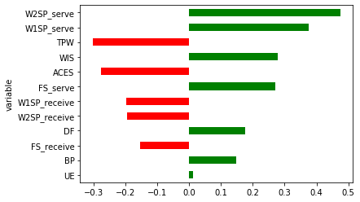

# TennisAbstract Project

## Table of contents

* [About the Project](#about-the-project)
* [Obtain Data](#obtain-data)
* [Calculate Stats](#calculate-stats)
* [Model](#model)
* [Interpret Results](#interpret-results)
* [Future Work](#future-work)
* [Contact](#contact)

## About the Project

In this project, I attempt to predict the outcome of ATP matches using point-by-point data (see section below).

The project contains the following
- *Tennis Project.ipynb*: technical notebook
- *data*: folder containing csv files
- *helper.py*: contains functions to create stats and model data sets

## Obtain Data

Data is from Jeff Sackmann's [Match Charting Project](http://www.tennisabstract.com/charting/meta.html), a crowdsourced effort to bring point-by-point data from professional matches to tennis enthusiasts.

I periodically scrape the site for matches and store it in a MySQL database. For this project, I queried my database for all men's matches between 2000 and 2018 and saved match and point data in csv files.

## Calculate Stats

I calculated the following stats:
- *FS_serve*: percentage of first serves that go in
- *W1SP_serve*: percentage of first serve points won
- *W2SP_serve*: percentage of second serve points won
- *FS_receive*: percentage of opponent's first serve that go in
- *W1SP_receive*: percentage of points won when opponent's first serve goes in
- *W2SP_receive*: percentage of points won when opponent's second serve goes in
- *TPW*: total number of points won
- *BP*: percentage of break ponts converted
- *ACES*: number of aces per serve
- *DF*: number of double faults per serve
- *UE*: number of unforced errors per point
- *WIS*: number of winners per point

**Note**: the last few stats are scaled on per point basis. For example, player A can serve more aces than player B if player A served more points. So the stats are scaled.

## Model

My match data has *player1*, *player2* and *winner*. So I created a column called *winPlayer1* that's a 1 if *player1* won the match or not. I will use **Logistic Regression** to predict the outcome.

I engineered my independent variables as followed:
- calculate a 5 year average of all stats for both players leading up to a match
- for a given stat, substract player2's average from player1's

So I will use these differences to predict my variable.

For my training data, I used all matches in 2017. Test data was made using 2018. When computing averages, I used a 5 year average.

## Interpret Results

My regression produced an accuracy of 64% on training data and 58% on test data. 

A couple of observations about the variable coefficients:
- winning % on 1st and 2nd serve have the highest effect, which makes sense since men heavily rely on their serve to win points
- total points won is negative, indicating that player1 wins fewer points than player2. It may seem like the opposite should be true. Here's what I think happens: player1 can win more points when player2 is serving than player2 winning more points when player1 serves. 

In general, it seems like having a good serve that sets players up for winners is the key. 

## Future Work

There are a couple of things I can do to potentially improve my model:
- calculate more statistics
- test different x-year averages
- factor in the court surface and use player's historical performance on that surface
- factor in the match date: weight recent matches more than older matches
- use common opponents: if player1 and player2 have both played player3, weight their matches with player3 more
- run other models

## Contact

- Connect with me on [Linkedin](https://www.linkedin.com/in/aneeshkodali)
- Read my [blog posts](https://medium.com/@aneesh.kodali)
- Check out my other [projects](https://github.com/aneeshkodali)